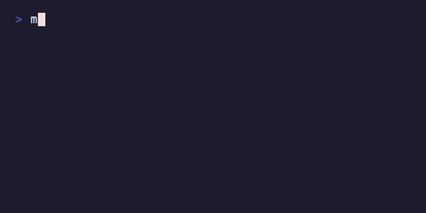
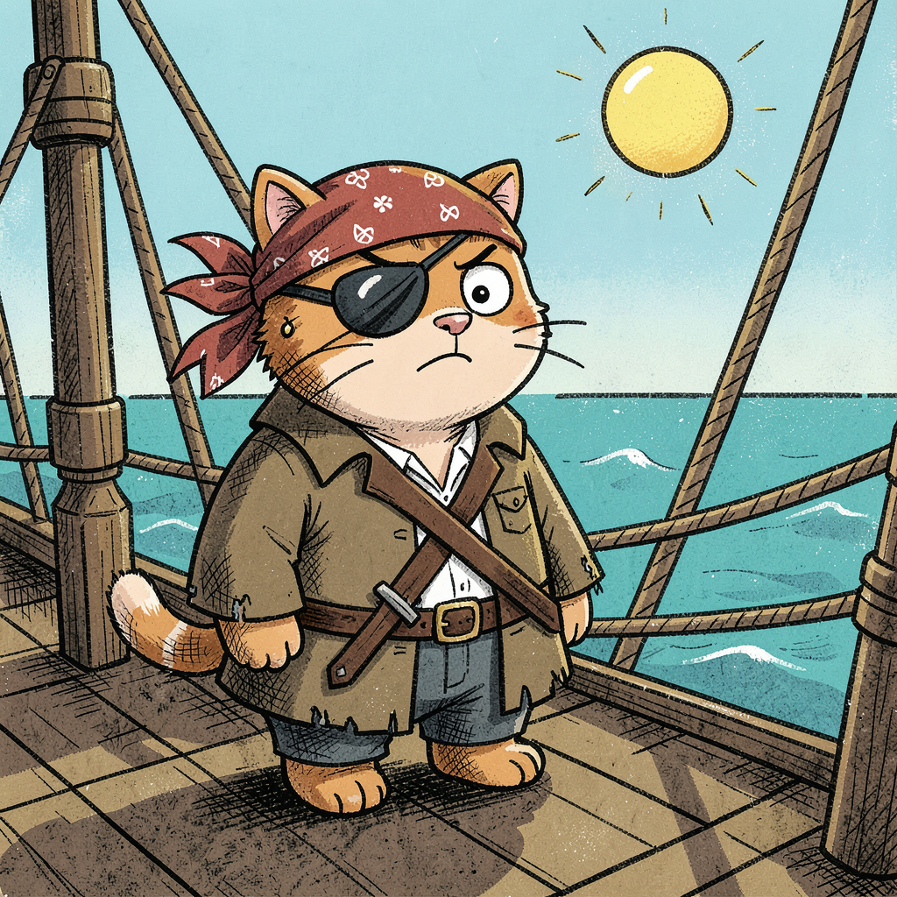
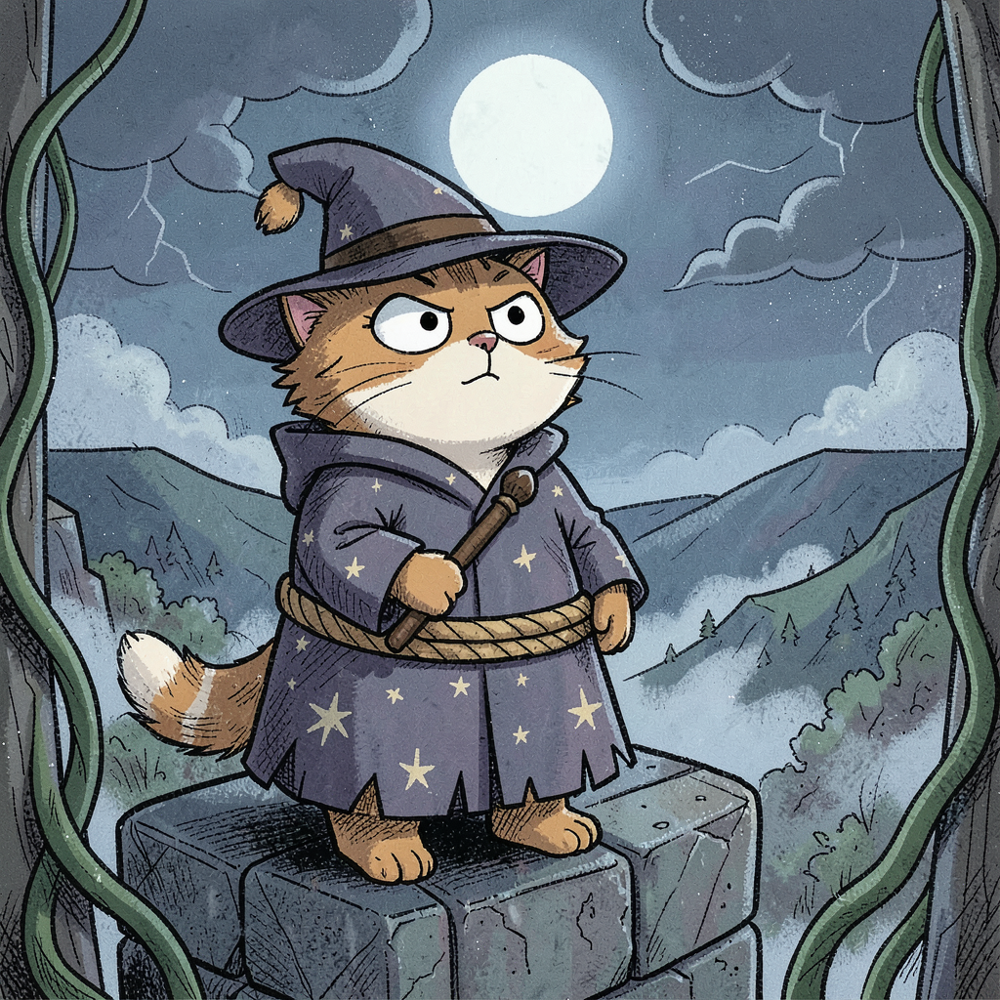

# AI Image CLI

**Type a few words, get an illustration — right in your terminal, all on your own Mac.**

`muse` is a small Ruby command-line tool that does one thing nicely: turns a prompt into a picture, then lets you play. Draw a grumpy cat pirate, swap him for a dog, paint him in chalk, add a hat — each idea is one short command away. There's even a local vision model that'll look at what you made and tell you what it thinks.

<p align="center">
  
</p>

Tools like ComfyUI and Draw Things are wonderful if you want every knob — but that's a lot of node-wiring and sliders before your first picture, and it all lives behind a mouse. `muse` goes the other way: one command, sensible defaults, and it lives right in your terminal where you can script it, alias it, and fold it into whatever you're already doing. 

Everything runs on small, local models that fit on a regular Mac and load fast, so it stays quick and fun to noodle around. No cloud, no subscription, nothing leaves your machine. Simple setup for a simple, delightful job.

And it's a *small* setup: drawing needs just **one model** (FLUX). That's the whole requirement. The extra commands — critique, regen, restyle, imagine — each ride on one optional model you can pull whenever you want them, or never. Start with one download, make pictures, grow from there.

> **Status & scope:** an actively used personal tool, Apple Silicon only (see [What you need](#what-you-need)). Stable for everyday use; the command surface may still shift. Issues and PRs welcome — see [Contributing](#contributing).

```bash
muse generate "a grumpy cat pirate wearing an eyepatch"
```

<p float="left">
  
  
</p>

Your image lands in `output/` (created automatically on first run) — open `output/output_001.png` to see it. Then keep going:

```bash
muse generate "make the hat blue"  --edit output/output_001.png   # tweak one thing
muse regen   output/output_001.png "a grumpy pirate dog"          # new subject, same look
muse restyle output/output_001.png --style chalk                  # new look, same subject
muse critique output/output_001.png                               # ask the AI what it thinks
```

## What you need

- **An Apple Silicon Mac** (M1 or newer). The image model runs on Apple's MLX/Metal — it won't work on Intel Macs, Linux, or in Docker.
- **Memory:** generation peaks around ~17GB. 16GB works but is tight (close other apps); 24GB+ is comfortable.
- **A free [Hugging Face](https://huggingface.co) account** — the image model downloads from there on first run.

First image is slow (it downloads the ~16GB model once, then caches it). After that, generation is tens of seconds per image.

## Install

Need: **Ruby 3+**, **Python 3**, **Ollama**, and a **Hugging Face token**. Commands below use [Homebrew](https://brew.sh); any installer works. Full details (and what each piece is for) live in the **[Install Guide](docs/install-guide.md)**.

Only the **FLUX image model is required** — it powers `generate` (and `--edit`), the heart of the tool. The three Ollama models are **optional**: each one just unlocks an extra command. Skip them now and pull any later when you want that feature.

```bash
# 1. Tools
brew install ruby python3 ollama
pip install mflux

# 2. Hugging Face token (mflux downloads the FLUX image model with it)
export HF_TOKEN="your_token_here"      # get one at huggingface.co/settings/tokens
                                       # add to ~/.zshrc to keep it
```

That's enough to run `muse generate`. Want the extra commands? Each is one optional model — pull only what you'll use:

```bash
ollama pull qwen2.5vl:7b                                                    # unlocks: critique / compare
ollama pull qwen2.5:3b                                                      # unlocks: regen / restyle
ollama pull gemma4:12b-mlx                                                  # unlocks: imagine
```

Run `muse models` anytime to see which models are configured, which are required, and what each one unlocks.

### Put `muse` on your PATH

So you can type `muse` from anywhere instead of `./muse` from the repo:

```bash
# from inside the repo
chmod +x muse
mkdir -p ~/.local/bin
ln -s "$PWD/muse" ~/.local/bin/muse          # ~/.local/bin is usually already on PATH
```

If `muse` still isn't found, add `~/.local/bin` to your PATH:

```bash
echo 'export PATH="$HOME/.local/bin:$PATH"' >> ~/.zshrc && source ~/.zshrc
```

(Prefer not to? Just run `./muse ...` from the repo root — same thing.)

## Try it

```bash
# Draw something
muse generate "a cat pirate wearing an eyepatch"

# Edit an existing image — change one thing, keep the rest
muse generate "wearing a hat" --edit output/rabbit.png
```

<p float="left">
  
  
</p>

```bash
# Get an AI critique of any image
muse critique output/output_001.png

# Stuck on a prompt? Imagine one through a short chat
muse imagine "a cat pirate"
```

Run `muse` with no arguments to list every command, or `muse generate` (etc.) to see a command's options.

## Learn more

- **[User Guide](docs/user-guide.md)** — every command, flag, and workflow, with examples
- **[Install Guide](docs/install-guide.md)** — step-by-step dependency setup
- **[Troubleshooting](docs/troubleshooting.md)** — fixes for common snags

## Tests

```bash
rake                # lint + unit tests — fast, no models or network
rake test           # unit tests only
rake lint           # standardrb only

# Smoke test — real end-to-end run (needs mflux + ollama + the models pulled)
rake smoke          # all steps
rake "smoke[chat]"  # one step
```

## Contributing

Issues and pull requests welcome — see **[CONTRIBUTING.md](CONTRIBUTING.md)**.

## License

MIT © Valerie Dryden. See [LICENSE](LICENSE).
