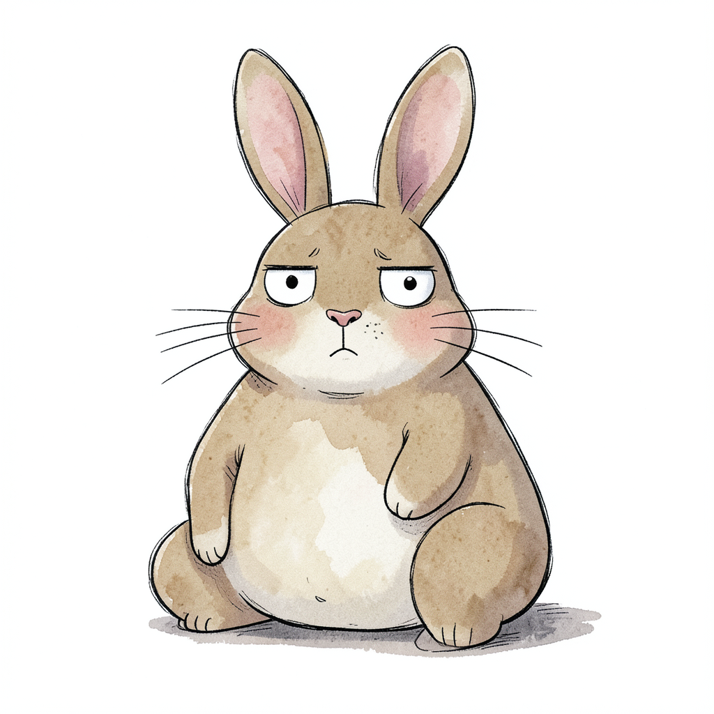
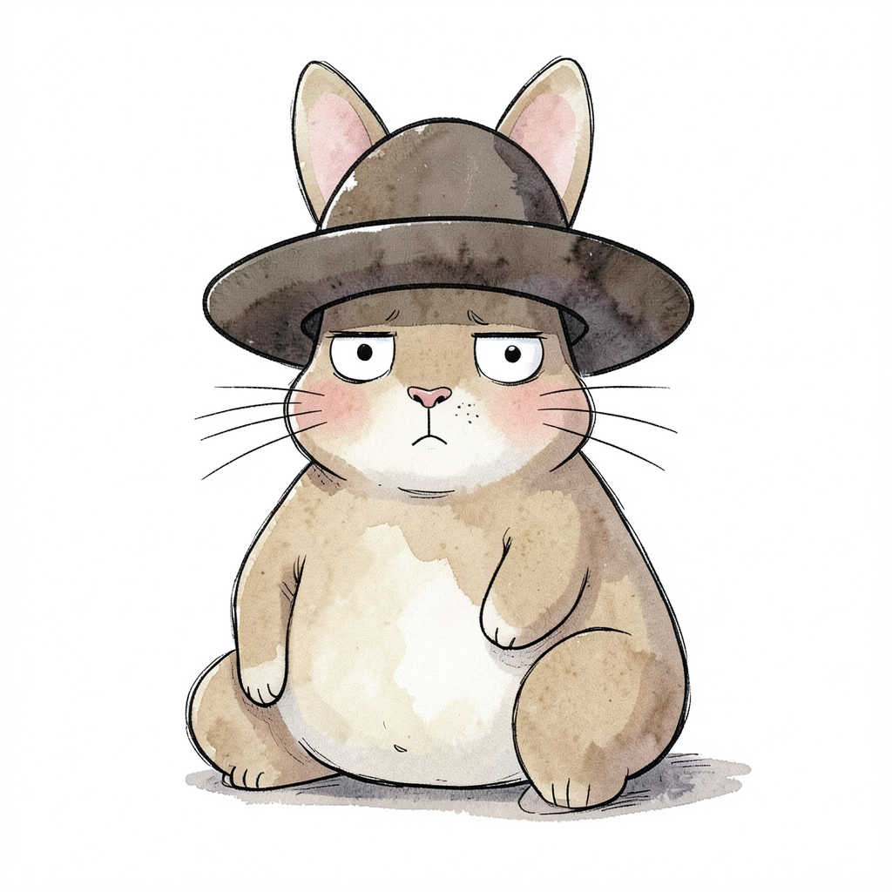
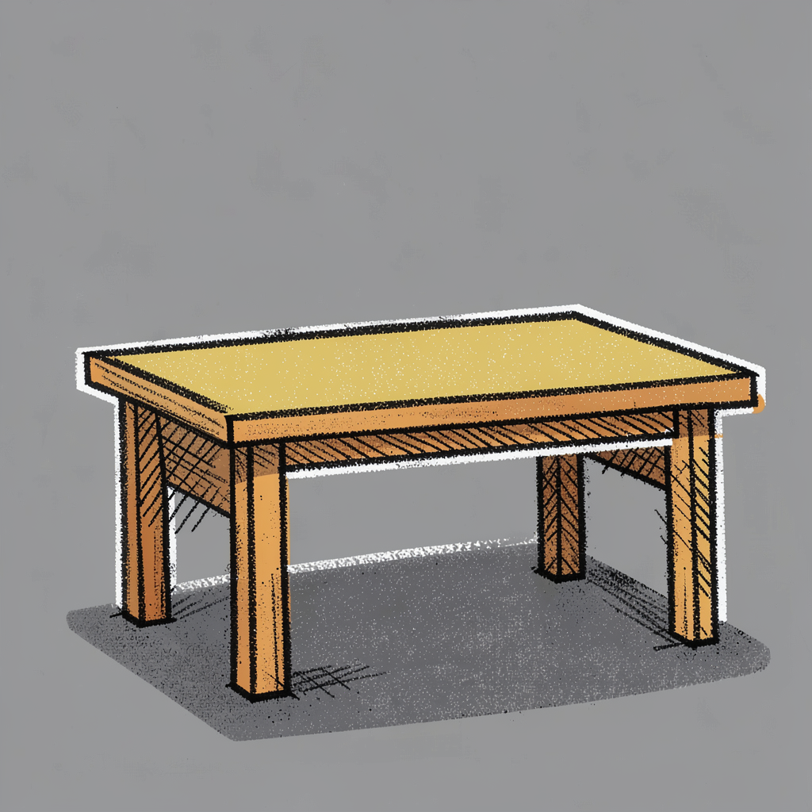
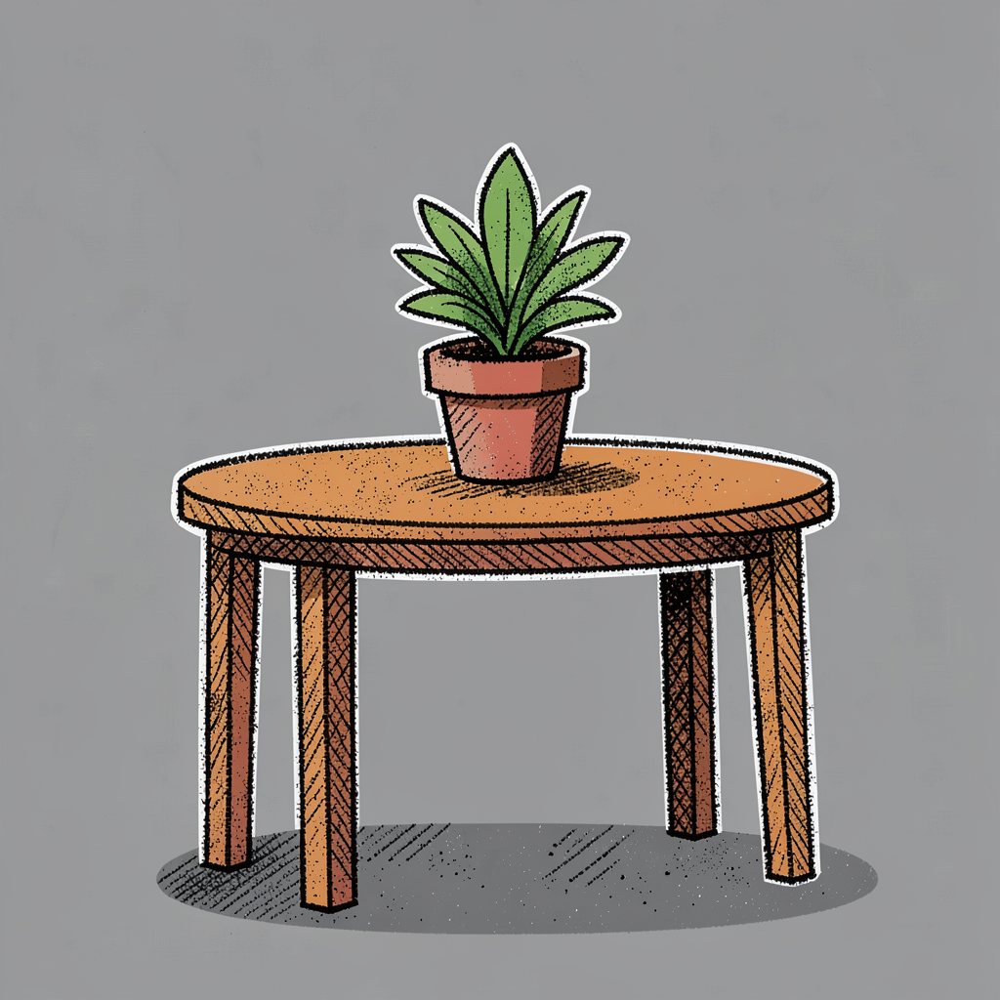
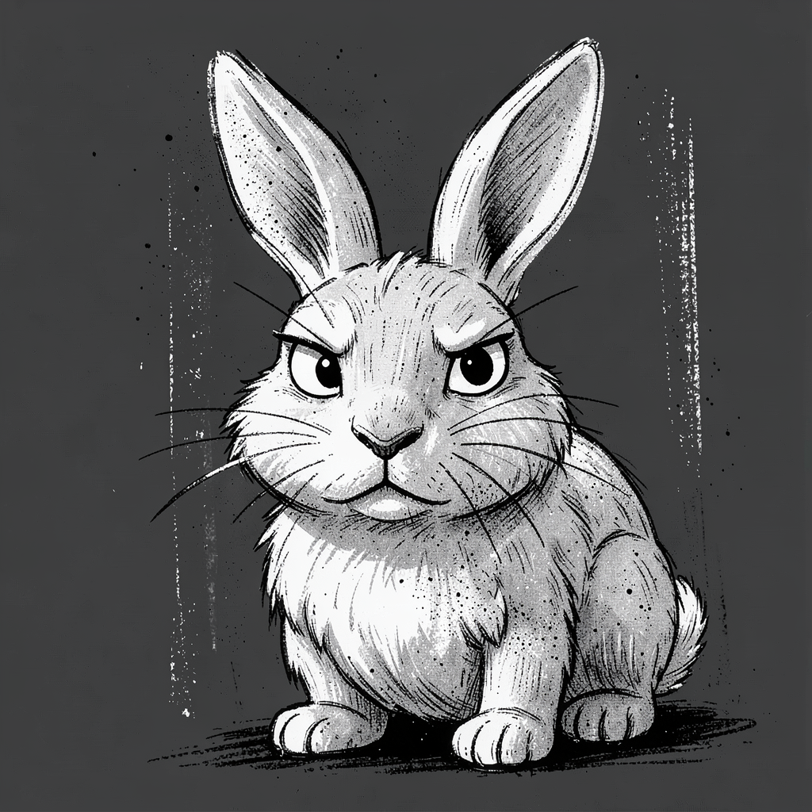

# User Guide

Full command reference for the AI Image CLI.

## Overview

All commands run through the `muse` executable in the repo root:

```bash
./muse              # list all commands
./muse generate     # show generate usage
```

## Table of Contents

- [Generate](#generate) — txt2img and edit
- [Style and LoRA](#style-and-lora) — understanding the style system
- [Edit](#edit) — instruction-based image editing
- [Regen](#regen) — redraw with new subject, same style
- [Restyle](#restyle) — redraw with new style, same subject
- [Imagine](#imagine) — develop a prompt with AI
- [Critique](#critique) — vision model feedback and chat
- [Models](#models) — which models run, and how to swap them

---

## Generate

Text-to-image and image editing via mflux.

### Basic txt2img

```bash
muse generate "a cat pirate wearing an eyepatch"
```

### Flags

| Flag | Description | Default |
|------|-------------|---------|
| `--style LAYERS` | Style preset(s), comma-separated (see below) | `illustration` |
| `--bare` | Drop the style prose block (LoRA still applies) | Off |
| `--edit <image>` | Edit an existing image instead of txt2img | Off |
| `--lora-style NAME` | Built-in style LoRA to fuse | `illustration` |
| `--lora-scale N` | LoRA strength multiplier | `1.0` |
| `--no-lora` | Disable LoRA entirely | Off |
| `--steps N` | Generation steps (min 2 — mflux divides by steps − 1) | `12` txt2img / `8` edit |
| `--seed N` | Pin seed for reproducibility | Random |
| `--prev` | Open in Preview when done | Off |
| `--verbose` | Print the full mflux command | Off |

Klein 4B is distilled and runs guidance-free — `--guidance` and negative prompts are not currently wired up (disabled in `lib/config.rb`).

### Examples

```bash
# Style preset
muse generate "a cat pirate" --style chalk

# Stack style layers (look + character/object)
muse generate "a cat pirate" --style chalk,character

# No style prose, LoRA still applies
muse generate "a cat pirate" --bare

# No style at all
muse generate "a cat pirate" --bare --no-lora

# Different LoRA with custom strength
muse generate "a cat pirate" --lora-style storyboard --lora-scale 0.6

# Override steps and seed
muse generate "a cat pirate" --steps 16 --seed 42

# Open in Preview
muse generate "a cat pirate" --prev
```

### Output

Images save to `output/output_NNN.png`. Each image gets a sidecar file (`output_NNN.json`) with the run's metadata (prompt, mode, seed, LoRA settings). mflux also embeds its own metadata blob directly in the PNG's EXIF — that's what `regen` and `restyle` read back from, not the sidecar.

---

## Style and LoRA

Klein 4B is distilled — it ignores `--guidance` and negative prompts. Style comes from **two independent levers**:

1. **Prose** — style words appended to your prompt (presets in `prompts/styles.json`)
2. **LoRA** — a small weight patch fused onto the model

### How they apply

| | Prose | LoRA |
|---|---|---|
| **txt2img** | On by default (`illustration`) | On by default (`illustration` @ 1.0) |
| **edit** (`--edit`) | **Never** (would corrupt the edit instruction) | On by default (weights are safe) |
| **Turn off with** | `--bare` (txt2img only) | `--no-lora` |
| **Change with** | `--style LAYERS` | `--lora-style NAME` |

If you pass `--style` while also using `--edit`, it's ignored with a warning — use `--lora-style` to change the look during an edit instead.

### Prose presets

Presets live in `prompts/styles.json`:

- `illustration` — default, loose hand-drawn ink + flat color
- `sketch` — felt-tip marker, hatching, flat cartoon color
- `chalk` — black-and-white, charcoal background, white brushstrokes, noir
- `delicate` — thin ink linework, watercolor washes, muted storybook palette

Plus two presets meant to compose with a look preset:

- `character` — goofy, soft, deadpan expression and proportions
- `object` — boxy, low-poly, flat-color object rendering

Combine layers with a comma, e.g. `--style chalk,character`.

### Making your own style

These presets are just prose I wrote into `prompts/styles.json` — there's nothing special about them, and you're meant to add your own. Open the file and add a new top-level key:

```json
{
  "illustration": { "...": "..." },

  "my-style": {
    "positive": "Loose gouache painting, visible brush texture, muted palette, soft edges, paper grain.",
    "negative": "Photorealistic, smooth gradients, glossy, 3D render."
  }
}
```

- `positive` is required — the words appended to your prompt when you pass `--style my-style`.
- `negative` is optional. Klein currently ignores it (negative prompts aren't supported by the distilled model — see `NEGATIVE_PROMPT_SUPPORTED` in `lib/config.rb`), but it's there for when that changes, or if you swap to a model that honors it.
- The key is what you type after `--style`. No code changes needed — `Styles.lookup` (`lib/styles.rb`) just reads the JSON and errors with the available list if you typo the name.
- Look presets (`illustration`, `chalk`, `sketch`, `delicate`) and modifier presets (`character`, `object`) are just convention, not a real distinction in the code — any key can be combined with any other via `--style a,b`.

Iterate the same way you'd iterate a normal prompt: pin a `--seed`, tweak the wording in `positive`, regenerate, repeat.

### Important

**`--bare` only drops the prose — the LoRA still applies.** To go fully unstyled:

```bash
muse generate "prompt" --bare --no-lora
```

The LoRA alone is subtle. For a strong sketch/cartoon look, you usually want prose too — `--bare` without writing your own style words into the prompt tends to look flat.

### Want a photo instead of an illustration?

The `illustration` LoRA is what pushes everything toward the hand-drawn look — it's on by default. Drop it (and the prose) for the closest thing to a photoreal result:

```bash
muse generate "prompt" --bare --no-lora
```

mflux ships a few other named `--lora-style` options (`portrait`, `storyboard`, `home`, etc.), but they're not tuned for this CLI's prompts/workflow — `--no-lora` is the supported way to turn illustration off.

### LoRA scale

`--lora-scale` controls the LoRA's strength as a multiplier on top of the named `--lora-style`:

- `1.0` — default
- `0.6` — lighter touch
- `1.5`+ — overdriven (can distort)

It only has an effect when a LoRA is actually applied (i.e. not combined with `--no-lora`).

---

## Edit

Instruction-based editing using `mflux-generate-flux2-edit`. Conditions on the source image and preserves everything you don't mention.

### Usage

```bash
muse generate "make the hat blue" --edit output/output_001.png
muse generate "add a chalk texture" --edit output/output_001.png --lora-style chalk
```

<p float="left">
  
  
</p>

### Notes

- Your instruction is sent **as-is** with no style prose block appended
- The default style LoRA still applies (adjusts weights, not prompt)
- `--style` is ignored in edit mode; use `--lora-style` to swap the LoRA look, or `--no-lora` to drop it

### What it's good at

| Good | Weak |
|------|------|
| Local attribute changes ("make the hat blue") | New composition ("put the character at a table") |
| Expression changes | Major scene changes |
| Object swaps ("make the hat a rabbit") | Adding large new objects |

The source conditioning anchors the original layout. For a new scene, use txt2img or `regen` instead.

---

## Regen

Redraw an image with a **new subject** while keeping the **same seed and style**.

Use this when you have an image whose seed and style you love but want a different (or expanded) subject — the case `--edit` is weak at.

### Usage

```bash
muse regen output/output_007.png "a table with a potted plant"
muse regen output/output_007.png "a chair by a window" --steps 16
```

<p float="left">
  
  
</p>

### How it works

1. Reads the source image's prompt + seed from its embedded mflux EXIF metadata
2. Splits the saved prompt into subject vs. style block (everything after the first comma)
3. Has a small local model (`REGEN_MODEL`, `qwen2.5:3b`) fuse your new subject into that style's vocabulary
4. Re-runs **txt2img** with the original seed

### Why not just `--edit`?

Edit conditions on the source pixels, so a big new object tends to render in a smooth, realistic default instead of the source's style. `regen` sidesteps this: the new subject is born in-style because it goes through txt2img with the style words fused in.

### Flags

Any `generate` flag passes straight through (`--steps`, `--prev`, etc.). The style block is already baked into the prompt, so `regen` runs with `--bare` internally to avoid doubling it.

---

## Restyle

Redraw an image with a **new style** while keeping the **same subject and seed**.

Mirror of `regen`: use this to redraw an image in a different look — sketch → chalk, for example.

### Usage

```bash
muse restyle output/rabbit.png --style chalk
muse restyle output/rabbit.png --style delicate --steps 16
```

<p float="left">
  
  
</p>

### How it works

1. Reads the source's saved prompt + seed from its embedded mflux EXIF metadata
2. Has the same local model (`REGEN_MODEL`, `qwen2.5:3b`) strip the old style words out of the prompt, leaving just the subject
3. Re-runs **txt2img** with your new `--style` and the original seed

### Caveats

- Requires `--style` — the command aborts with usage if you don't pass one
- Seed reuse across a big style change is looser than `regen`'s subject swap
- The style block is large, so the composition stays in the same family but isn't pixel-locked
- A thin subject (`a table`) can read as abstract in a heavy style like chalk; richer subjects restyle best

---

## Imagine

Develop a rough idea into a strong Flux prompt through a short chat loop.

### Usage

```bash
muse imagine "a cat pirate"
# answer each question; type `done` anytime to finalize early
```

### How it works

The model asks focused visual questions one at a time — subject, scene, action, mood, framing, light. Never asks about style. Caps at 5 questions, then prints the final prompt and a ready-to-run `muse generate` command.

### Model

Uses the larger local text model (`IMAGINE_MODEL`), so the first question lags while it loads. Stopped automatically when the command exits — whether it finishes normally or errors out — so it never stays resident.

---

## Critique

Get feedback from a vision model, ask specific questions, or compare two images.

### Full structured critique

```bash
muse critique my_art.png
```

### Ask a specific question

```bash
muse critique my_art.png --ask "is the focal point working?"
```

### Interactive chat session

```bash
muse critique my_art.png --chat
muse critique my_art.png --ask "your opening question" --chat
# type exit/done/quit when done
```

### Compare two images

```bash
muse critique image_a.png image_b.png
```

### Model

Uses the configured vision model (`VISION_MODEL`, `qwen2.5vl:7b`), loaded on demand and stopped automatically when the command exits — in every mode, and even if it errors out — so it never stays resident.

---

## Models

Only the **image model is required** — it powers `generate` (and `--edit`). The
three Ollama models are optional; each just unlocks one extra command, so pull
only the ones you want.

### See what's configured

```bash
muse models
```

Lists every model muse uses, grouped into required vs. optional, with the
commands each one unlocks:

```
Models muse uses (configured in lib/config.rb):

  REQUIRED
    flux2-klein-4b                                                  generate, edit

  OPTIONAL  (pull only what you want; each unlocks its commands)
    qwen2.5vl:7b                                                    critique
    qwen2.5:3b                                                      regen, restyle
    hf.co/yuxinlu1/gemma-4-12B-it-Claude-4.6-4.8-Opus-GGUF:Q4_K_M   imagine
```

### Swapping a model

Model names are hardcoded in `lib/config.rb`, not environment variables — edit that file to swap any of them:

| Constant | Role | Default |
|----------|------|---------|
| `IMAGE_MODEL` | Image generation (txt2img + edit) via mflux | `flux2-klein-4b` |
| `VISION_MODEL` | Vision critique / compare / chat | `qwen2.5vl:7b` |
| `REGEN_MODEL` | regen / restyle subject + style rewrites | `qwen2.5:3b` |
| `IMAGINE_MODEL` | imagine prompt chat | `hf.co/yuxinlu1/gemma-4-12B-it-Claude-4.6-4.8-Opus-GGUF:Q4_K_M` |

`HF_TOKEN` is the one real environment variable the CLI needs — it's required by mflux to download the image model on first use.

### Ollama commands

```bash
ollama list          # see installed models
ollama ps            # see running models
ollama rm MODEL      # remove a model
ollama pull hf.co/<user>/<repo>:<quant>  # pull GGUF from Hugging Face
```
